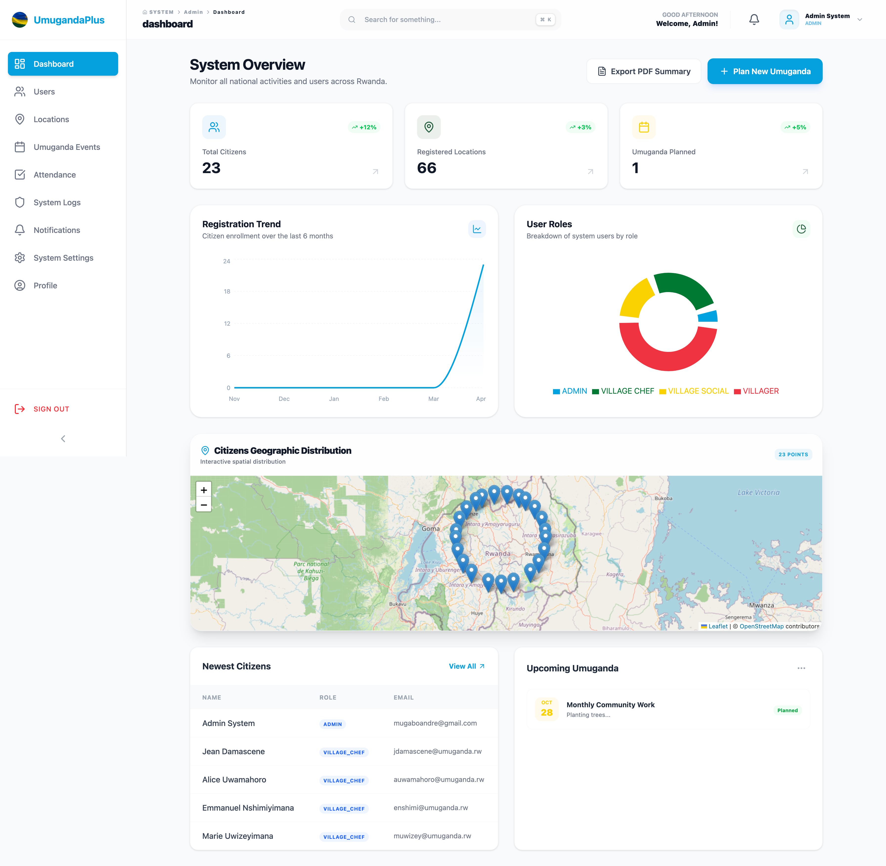
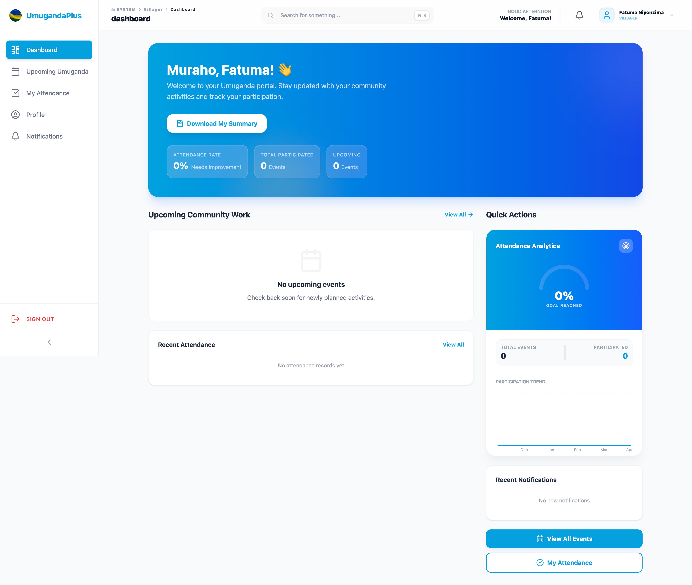
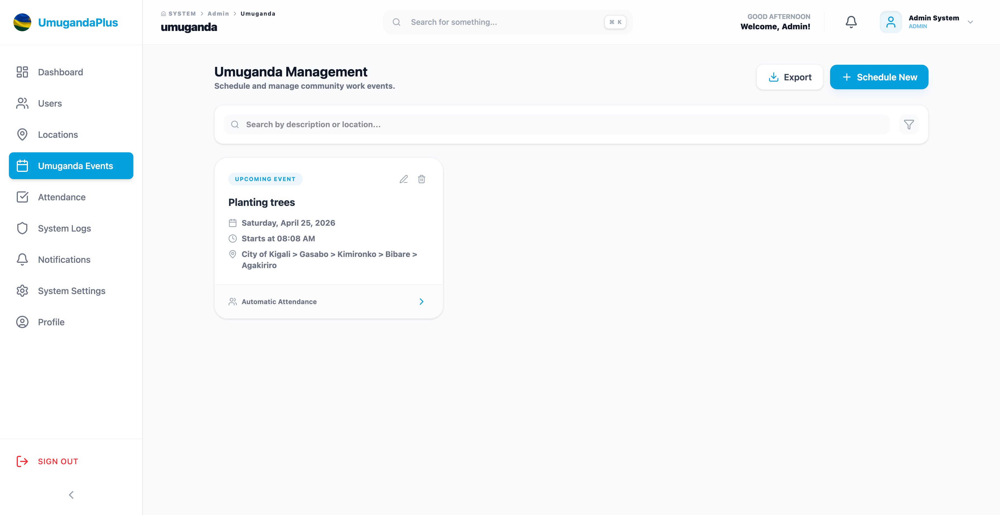
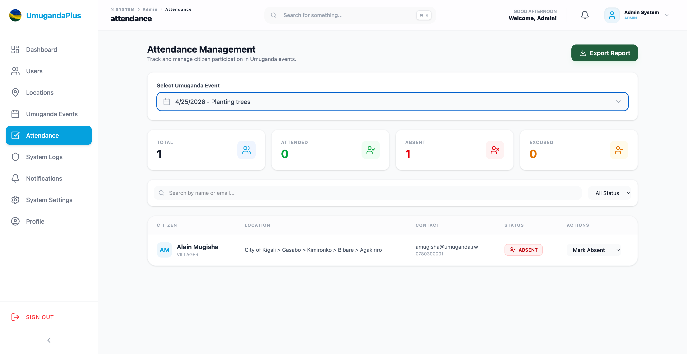
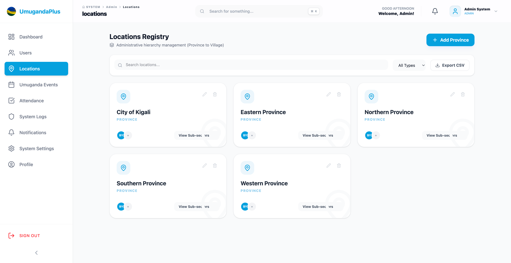
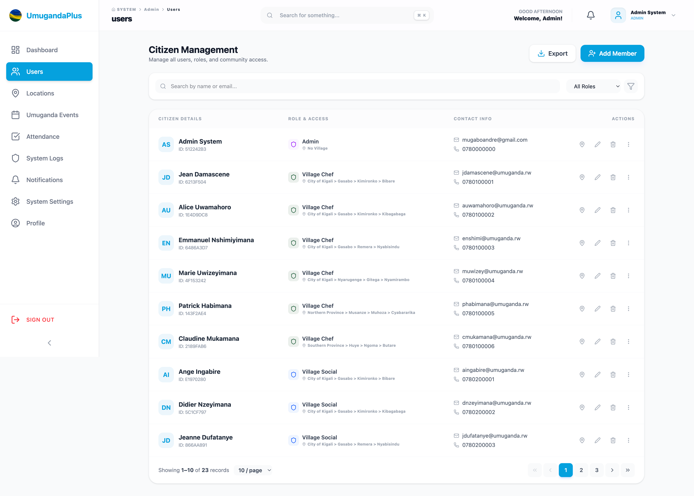
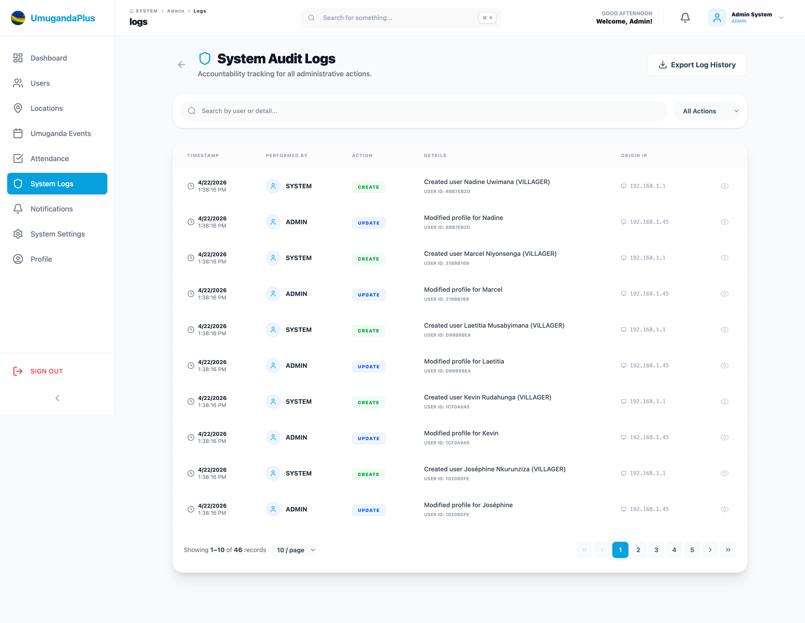
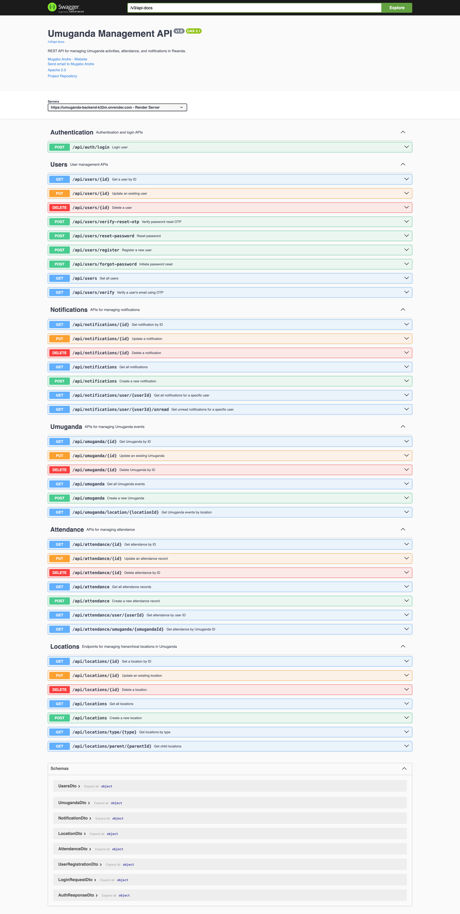

# Umuganda Management System

[](Images/logo.png)

### *Twese Hamwe, Buri Kigero — Empowering Communities through Digital Coordination*

The **Umuganda Management System** is a comprehensive digital platform designed to streamline and modernize the coordination of *Umuganda*—Rwanda's traditional community work. By replacing manual processes with a robust, data-driven solution, the system ensures better event planning, automated attendance tracking, and seamless communication between local leaders and citizens.

---

## Key Features

### Modern Authentication & Security
- **Role-Based Access Control (RBAC)**: Personalized dashboards for Administrators (ADMIN), Local Leaders (CHEF/SOCIAL), and Villagers.
- **Stateless JWT Security**: Industry-standard **JSON Web Tokens** for secure, scalable authentication.
- **Enterprise-Grade Encryption**: **BCrypt** industrial-strength password hashing with automated salt generation.


### Event Lifecycle Management
- **Smart Scheduling**: Effortlessly plan and publish Umuganda activities across different locations.
- **Progress Tracking**: Monitor the status of community projects from initiation to completion.

### Intelligent Location Mapping
- **Hierarchical Organization**: Management of activities based on administrative levels (Districts, Sectors, Cells, Villages).
- **Localized Assignments**: Assigning specific tasks and leaders to respective geographical areas.

### Digital Attendance
- **Real-time Record-keeping**: Automated attendance tracking to ensure transparency and accountability.
- **Historical Data**: Easily accessible participation records for administrative reporting.

### Integrated Notification System
- **Citizen Engagement**: Automated email and internal system notifications for upcoming events and announcements.
- **Leader Alerts**: Real-time updates for administrative actions and task assignments.

### Advanced Geographic Intelligence
- **Interactive Spatial Mapping**: Real-time visualization of community activities across Rwanda using Leaflet.js.
- **Spatial Fallbacks**: Robust coordinate systems ensuring map stability across all administrative levels.

### Professional Reporting Engine
- **Branded PDF Summaries**: Professional, board-ready activity summaries for both citizens and administrators.
- **Data Export**: Registry exports in CSV format for offline administrative analysis.


---

## Technology Stack

### **Backend**
- **Framework**: Spring Boot 3.x
- **Language**: Java 17
- **Database**: PostgreSQL
- **Security**: Spring Security 6, JWT, & BCrypt

- **Documentation**: Swagger/OpenAPI (SpringDoc)
- **Tooling**: Maven, Lombok

### **Frontend**
- **Framework**: React 19 + Vite
- **State Management**: Redux Toolkit
- **Styling**: Tailwind CSS 4.x
- **Icons**: Lucide React
- **Data Visualization**: Recharts
- **Form Handling**: React Hook Form & Zod

### **Infrastructure**
- **Containerization**: Docker (Multi-stage builds)
- **Hosting**: Render (API & Database)

---

## Project Structure

```text
.
├── umuganda/               # Backend Spring Boot Project
│   ├── src/                # Soul of the API
│   ├── Dockerfile          # Container config
│   └── pom.xml             # Dependencies
├── umuganda-frontend/      # Frontend React Project
│   ├── src/                # UI Components & State
│   ├── public/             # Static Assets
│   └── package.json        # Dependencies
├── Images/                 # Project Screenshots & Branding
└── doc.md                  # API & Deployment Links
```

---

## System Walkthrough & Visuals

Experience the intuitive and modern interface designed for both administrators and citizens.

### **1. Admin Intelligence Dashboard**
A powerful oversight portal featuring real-time statistics, registration trends, and geographic distribution mapping of community activities.


### **2. Personalized Villager Experience**
A clean, focused dashboard for citizens to view their upcoming Umuganda tasks and track their personalized attendance history.


### **3. Collaborative Umuganda Management**
Tools for leaders to schedule, describe, and coordinate community work events across different administrative levels.


### **4. Digital Attendance Tracking**
Automated record-keeping system with filtering and CSV/PDF export capabilities for verified participation history.


### **5. Hierarchical Location Governance**
Management of Rwanda's administrative hierarchy, ensuring tasks and leaders are perfectly aligned with their specific villages.


### **6. Unified Citizen Registry**
Secure and efficient management of user profiles, role assignments, and location-based administration.


### **7. Enterprise Audit Trail**
Complete accountability through a dedicated portal tracking every administrative action and system change.


### **8. Interactive API Ecosystem (Swagger)**
Fully documented backend with interactive Swagger UI, allowing developers to explore and test endpoints in real-time.


---

## Getting Started


### Prerequisites
- JDK 17 or higher
- Node.js 18+ & npm
- PostgreSQL (if running locally without Docker)
- Docker (optional, for containerized run)

### Deployment with Docker Compose

The Umuganda Management System is fully containerized. For the easiest setup, you can launch the entire ecosystem (Nginx Frontend, Spring Boot Backend, and PostgreSQL Database) with a single command:

```bash
docker-compose up --build
```

#### Services & Routing
- **Frontend (Web UI)**: [http://localhost:5173](http://localhost:5173)
- **Backend (API)**: [http://localhost:9090](http://localhost:9090)
- **Interactive API Docs (Swagger)**: [http://localhost:9090/swagger-ui/index.html](http://localhost:9090/swagger-ui/index.html)
- **PostgreSQL Database**: Port `5433` (on host machine for inspection)

#### Environment Variables
The system uses environment variables for flexible configuration. You can customize these in the `docker-compose.yml` or by creating a `.env` file:

| Variable | Description | Default |
|----------|-------------|---------|
| `DB_HOST` | Database service name or host | `db` |
| `DB_PORT` | Port of the database | `5432` |
| `DB_NAME` | Name of the database | `umuganda_db` |
| `DB_USERNAME` | Database username | `postgres` |
| `DB_PASSWORD` | Database password | `123` |
| `VITE_API_BASE_URL` | Frontend API endpoint | `https://umuganda-backend-k32m.onrender.com/api` |

---

## Advanced Modernization

The system recently underwent a comprehensive modernization phase to meet enterprise SaaS standards:

- **Progressive Web App (PWA)**: Fully installable as a native app on iOS, Android, and Desktop with offline capability for field workers.
- **Skeleton UI Architecture**: Implemented shimmer loading states across all dashboards to eliminate layout shift and improve perceived performance.
- **Enterprise Audit Trail**: A dedicated, paginated system oversight portal that tracks every administrative action for total accountability.
- **Role-Based Navigation (RBAC)**: Intelligent Topbar and Sidebar components that dynamically adapt their interface and security gates based on the authenticated user role.

---


## Technical Architecture

This project follows a **Modular Monolith** architecture with a strong emphasis on the **Controller-Service-Repository** pattern.

### Backend Strategy
- **Audit Tracking**: Automatic tracking of record creation and modification.
- **DTO Layer**: Strict separation between internal models and external API responses.
- **Global Exception Handling**: Centralized management of application errors.

### Frontend Strategy
- **Atomic State**: Managed via Redux Toolkit slices.
- **Component Reusability**: Modular UI components (Modals, Inputs, Cards) for consistent design.
- **Form Validation**: Type-safe validation using Zod and React Hook Form.

---

## Running Locally (Development Mode)

If you prefer to run the components individually for development:

**1. Backend (Spring Boot)**
```bash
cd umuganda
./mvnw spring-boot:run
```

**2. Frontend (React/Vite)**
```bash
cd umuganda-frontend
npm install
npm run dev
```

---

Built with passion for community progress.
